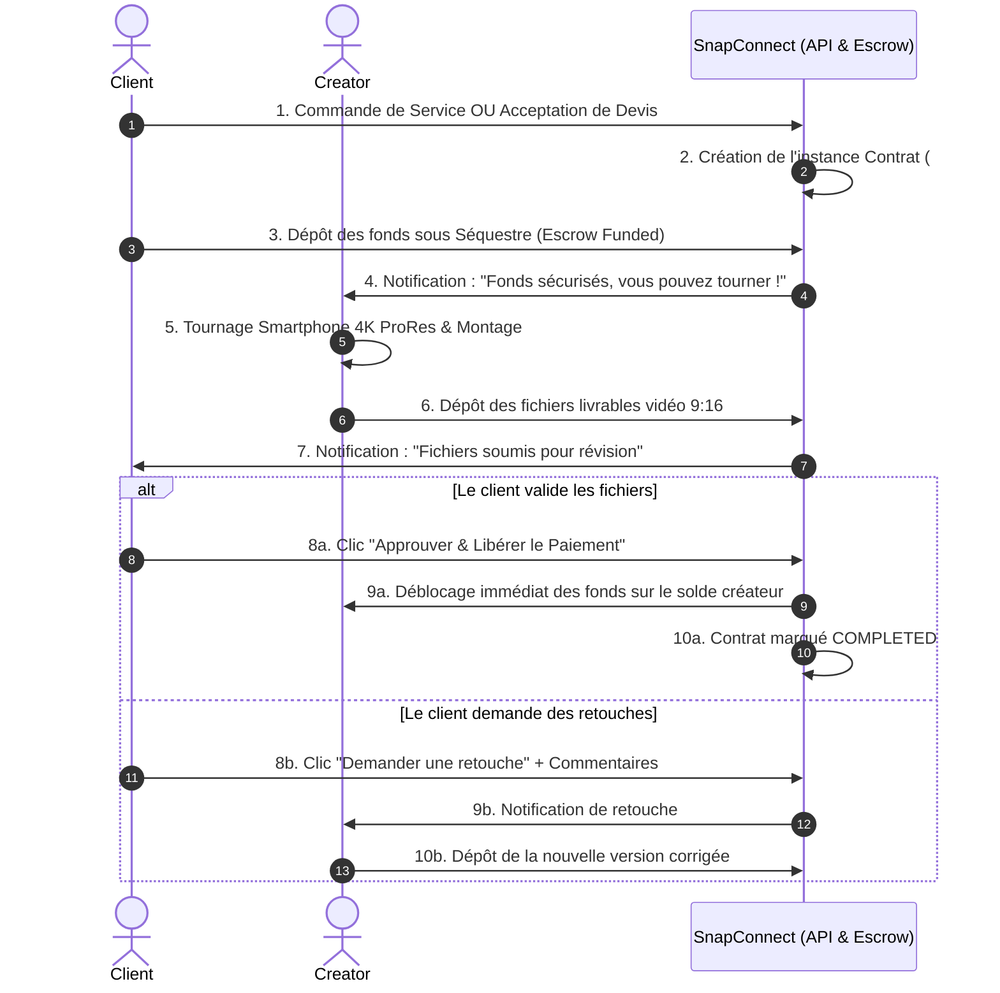

# 📘 MÉMOIRE TECHNIQUE ET ARCHITECTURAL DU PROJET PFE — SNAPCONNECT

---

**Projet de Fin d'Études (PFE)**  
**Plateforme :** SnapConnect — Marketplace Spécialisée pour Créateurs de Contenu Smartphone  
**Auteur / Rôle :** Senior Software Architect & Lead Frontend Engineer  
**Date de Création :** Août 2026  
**Dernière Mise à Jour :** Août 2026  
**Version :** 1.0.0  

---

## 📑 TABLE DES MATIÈRES

1. [Introduction Générale et Contexte Métier](#1-introduction-générale-et-contexte-métier)
2. [Analyse du Problème et Proposition de Valeur](#2-analyse-du-problème-et-proposition-de-valeur)
3. [Architecture Fonctionnelle Globale](#3-architecture-fonctionnelle-globale)
   - 3.1 Les Deux Modèles Économiques (Modèle A vs Modèle B)
   - 3.2 La Convergence vers le Modèle de Contrat Unique
   - 3.3 Système de Séquestre Financier (Escrow Protection)
   - 3.4 Système de Spécification et Vérification du Matériel Mobile
4. [Architecture Logicielle & Technique (Frontend & Backend)](#4-architecture-logicielle--technique)
   - 4.1 Stack Technologique et Contraintes
   - 4.2 Architecture Frontend Angular 19 Standalone & Signals
   - 4.3 Système de Design Pure CSS (Design System Tokens)
   - 4.4 Sécurité, Guards et Intercepteurs JWT
   - 4.5 Modèle de Données & Relations
5. [Diagrammes d'Architecture et Flux](#5-diagrammes-darchitecture-et-flux)
   - 5.1 Diagramme d'Architecture Globale
   - 5.2 Diagramme de Cycle de Vie d'un Contrat
   - 5.3 Diagramme Entité-Relation (ERD)
6. [Journal de Bord des Réalisations Techniques](#6-journal-de-bord-des-réalisations-techniques)
7. [Feuille de Route et Évolutions Futures](#7-feuille-de-route-et-évolutions-futures)

---

## 1. INTRODUCTION GÉNÉRALE ET CONTEXTE MÉTIER

Le projet **SnapConnect** est une plateforme marketplace web à double facette (*two-sided marketplace*), conçue pour répondre à la mutation radicale de la création de contenu digital pour les réseaux sociaux (TikTok, Instagram Reels, YouTube Shorts, UGC publicitaire).

Alors que les plateformes traditionnelles comme Upwork, Fiverr ou Malt restent généralistes et souvent axées sur des productions vidéo lourdes (caméras cinéma, équipes de tournage complexes), **SnapConnect se focalise exclusivement et nativement sur la photographie et la vidéographie réalisées à 100% sur Smartphone**.

### Les Deux Acteurs Principaux :
- **Les Clients (Clients/Entreprises) :** Marques D2C, boutiques e-commerce, restaurants, agences immobilières, créateurs de mode, et PME ayant un besoin vital de contenu photo/vidéo vertical régulier, authentique et abordable.
- **Les Créateurs Mobiles (Mobile Content Creators) :** Vidéastes et photographes maîtrisant les smartphones haut de gamme (iPhone 15/16 Pro en 4K ProRes, Samsung Galaxy S24 Ultra, Google Pixel 9 Pro), les stabilisateurs gimbals, les micros sans fil et l'éclairage nomade.

---

## 2. ANALYSE DU PROBLÈME ET PROPOSITION DE VALEUR

### 2.1 Comparatif : Production Traditionnelle vs SnapConnect

| Dimension | Agence de Production Traditionnelle | Créateur Mobile SnapConnect |
| :--- | :--- | :--- |
| **Matériel** | Caméras lourdes DSLR/Cinéma, équipe encombrante | Smartphone 4K 60fps/ProRes, Gimbal, Micro-cravate |
| **Format natif** | Horizontal 16:9 adapté pour TV/YouTube | Vertical 9:16 optimisé pour l'algorithme TikTok/Reels |
| **Délai de livraison** | 2 à 4 semaines de post-production | **24 à 48 heures** (permet de surfer sur les tendances) |
| **Coût moyen** | 1 500 € à 5 000 € par journée | **50 € à 300 €** par vidéo/mission |
| **Engagement audience** | Rend souvent un effet "publicité froide" | **Authentique, immersif, taux de conversion x3** |

---

## 3. ARCHITECTURE FONCTIONNELLE GLOBALE

```
                          ┌────────────────────────────────┐
                          │          SNAPCONNECT           │
                          │   Unified Mobile Marketplace   │
                          └───────────────┬────────────────┘
                                          │
                  ┌───────────────────────┴───────────────────────┐
                  ▼                                               ▼
     ┌────────────────────────┐                      ┌────────────────────────┐
     │  MODÈLE A : JOB BOARD  │                      │  MODÈLE B : PACKAGES   │
     │  (Client Briefs)       │                      │  (Creator Gigs)        │
     └────────────┬───────────┘                      └────────────┬───────────┘
                  │                                               │
                  │ [Proposition / Devis]                         │ [Commande Directe]
                  │                                               │
                  └───────────────────────┬───────────────────────┘
                                          ▼
                         ┌─────────────────────────────────┐
                         │      CONTRAT UNIQUE (AD01)      │
                         │    - Système Escrow Séquestre   │
                         │    - Suivi des Jalons (Milestones)│
                         │    - Révisions & Approbation    │
                         └────────────────┬────────────────┘
                                          ▼
                         ┌─────────────────────────────────┐
                         │   LIVRAISON 4K & CLÔTURE        │
                         │    - Téléchargement Fichiers    │
                         │    - Libération des Fonds       │
                         │    - Évaluation & Avis Double   │
                         └─────────────────────────────────┘
```

### 3.1 Les Deux Modèles Économiques
1. **Modèle A (Client-Initiated / Job Board) :** Le client publie un brief sur-mesure décrivant le projet, le modèle de smartphone exigé, le lieu et son budget (Fixe ou Horaire). Les créateurs postulent en soumettant un devis et leur matériel.
2. **Modèle B (Creator-Initiated / Predefined Packages) :** Le créateur mobile liste des prestations prêtes à l'achat avec 3 formules claires (*Basic*, *Standard*, *Premium*), un nombre défini de vidéos et un délai de livraison garanti (ex: 24h ou 48h).

### 3.2 La Convergence vers le Modèle de Contrat Unique (Décision Architecturale AD01)
Qu'une mission provienne du Modèle A ou du Modèle B, elle se transforme en une instance de **Contrat Unique**. Cela permet de réutiliser 100% de la logique :
- Espace de travail partagé.
- Fil de discussion dédié à la commande.
- Gestion du séquestre financier (*Escrow*).
- Dépôt et validation des fichiers livrables 4K.
- Gestion du quota de retouches (revisions).

### 3.3 Système de Séquestre Financier (Escrow)
- Dès que le contrat est validé, les fonds sont bloqués en séquestre.
- Le créateur réalise le tournage en toute confiance financière.
- Le client contrôle la qualité des livrables avant de cliquer sur **« Approuver & Libérer le Paiement »**.
- En cas de litige, un mécanisme de médiation administrateur est prévu.

### 3.4 Système de Spécification et Vérification du Matériel Mobile
Chaque profil créateur, proposition et mission intègre les métadonnées de l'équipement :
- **Modèle de Smartphone :** iPhone 16 Pro Max, iPhone 15 Pro, Samsung S24 Ultra, Pixel 9 Pro...
- **Capacités vidéo :** 4K 60fps, 10-bit ProRes Log, 120fps Slow-Motion, Macro lens.
- **Accessoires :** Gimbal DJI Osmo Mobile 6, Zhiyun Smooth 5S, Micros sans fil Rode Wireless Pro / DJI Mic 2, Panneaux LED nomades.

---

## 4. ARCHITECTURE LOGICIELLE & TECHNIQUE

### 4.1 Stack Technologique
- **Frontend :** Angular 19.1.8 (Composants Standalone, Architecture par Signaux `signal()`, `computed()`, `input()`, `output()`).
- **Styling :** Standard Pure CSS avec Design Tokens Custom Properties (Zéro SCSS, Zéro Tailwind conformément aux exigences).
- **Routing :** Lazy Loading sur l'intégralité des 57 routes pour un temps de chargement initial minimal.
- **Backend :** Spring Boot 4.0.7 / Java 17 / MySQL 8.0.46 (API REST stateless).
- **Communication :** JWT Bearer Tokens via HTTP Interceptor.

### 4.2 Organisation Modulaire du Code Frontend

```
src/
├── app/
│   ├── core/                        # Couche Noyau Singleton
│   │   ├── guards/                  # auth.guard, role.guard, admin.guard, guest.guard
│   │   ├── interceptors/            # jwt.interceptor, error.interceptor
│   │   ├── models/                  # 18 Interfaces Typescript du domaine
│   │   └── services/                # 20 Services réactifs basés sur Signals
│   │
│   ├── shared/                      # Composants UI Réutilisables
│   │   └── components/
│   │       ├── navbar/              # Barre de navigation responsive avec badges live
│   │       ├── footer/              # Pied de page avec liens & légal
│   │       ├── creator-card/        # Carte créateur mobile avec badges gear
│   │       ├── service-card/        # Carte package gig avec aperçu média & tarif
│   │       ├── job-card/            # Carte mission avec exigences matérielles
│   │       ├── category-card/       # Carte catégorie thématique
│   │       ├── rating-stars/        # Système d'étoiles de notation dynamique
│   │       └── media-modal/         # Lecteur lightbox vidéo 4K & photo plein écran
│   │
│   ├── features/                    # Modules Fonctionnels Métier
│   │   ├── public/                  # Landing, How-It-Works, Categories, About, Help...
│   │   ├── auth/                    # Login (avec démo 1-clic), Register (choix de rôle)...
│   │   ├── marketplace/             # Recherche créateurs, services, job board, profils
│   │   ├── client/                  # Dashboard client, création de brief, gestion contrats
│   │   ├── creator/                 # Dashboard créateur, studio portfolio, gestion services
│   │   ├── shared-features/         # Contrat unique, messagerie direct, notifications...
│   │   └── admin/                   # Dashboard d'administration & modération
│   │
│   ├── app.routes.ts                # Configuration globale des 57 routes
│   └── app.config.ts                # Configuration providers (HttpClient, Router)
└── styles.css                       # Design System global complet (500+ lignes)
```

---

## 5. DIAGRAMMES D'ARCHITECTURE ET FLUX

### 5.1 Diagramme de Flux du Contrat et de l'Escrow



---

## 6. JOURNAL DE BORD DES RÉALISATIONS TECHNIQUES

### Phase 1 — Socle & Fondations (✅ Terminé)
- [x] Configuration d'`angular.json` en mode Standard Pure CSS.
- [x] Nettoyage et suppression intégrale de tous les fichiers et dossiers `.scss` obsolètes (`src/styles/*.scss`, `app.component.scss`, etc.).
- [x] Création du **Design System Global** (`src/styles.css`) : Palette HSL sombre/violet/rose, système typographique Outfit, variables d'espacement, composants de boutons, effets de glassmorphism (`backdrop-filter`).
- [x] Définition des 18 modèles TypeScript du domaine métier (`user`, `creator`, `job`, `service`, `contract`, `portfolio`, `message`, `notification`...).
- [x] Implémentation des 4 Guards fonctionnels (`authGuard`, `roleGuard`, `adminGuard`, `guestGuard`).
- [x] Implémentation des 2 Intercepteurs (`jwtInterceptor`, `errorInterceptor`).
- [x] Implémentation des 20 Services réactifs avec Angular Signals et fallbacks de démonstration.
- [x] Configuration de l'arbre complet des 57 routes applicatives avec lazy-loading.

### Phase 2 — Composants Partagés & Marketplace (✅ Terminé)
- [x] Création de la `NavbarComponent` (Responsive, scroll progressif, menu utilisateur, notifications live).
- [x] Création du `FooterComponent` (Liens légaux, colonnes thématiques, badges 4K).
- [x] Création de `RatingStarsComponent` (Affichage dynamique des notes).
- [x] Création de `MediaModalComponent` (Lecteur Lightbox pour vidéos et photos de portfolio).
- [x] Création de `CreatorCardComponent` (Avatar, badge de vérification, modèle de smartphone, tarif/heure).
- [x] Création de `ServiceCardComponent` (Aperçu média, délais 24h-48h, prix de départ).
- [x] Création de `JobCardComponent` (Budget, compétences, matériel requis, candidatures).
- [x] Création de `CategoryCardComponent` (Pillules thématiques avec emojis et compteurs).

### Phase 3 — Pages Publiques, Auth & Marketplace Complètes (✅ Terminé)
- [x] **Landing Page (`/`) :** Hero interactif avec recherche à 3 modes, mock-up de smartphone dynamique avec badges flottants, comparatif agence vs smartphone, sections vitrines.
- [x] **Login (`/auth/login`) :** Boutons d'accès rapide en 1-clic pour tester les 3 rôles (Client, Créateur, Admin).
- [x] **Register (`/auth/register`) :** Sélecteur de rôle interactif (Client vs Créateur).
- [x] **Marketplace Créateurs (`/creators`) :** Filtres par smartphone, spécialités, prix, tri.
- [x] **Profil Créateur Détaillé (`/creators/:id`) :** Onglets Portfolio, Packages, Bio et Sidebar d'équipements studio mobile.
- [x] **Marketplace Services (`/services`) & Détail (`/services/:id`) :** Sélecteur de formules 3-tiers (*Basic*, *Standard*, *Premium*).
- [x] **Job Board (`/jobs`) & Détail (`/jobs/:id`) :** Modal de soumission de proposition avec spécification du smartphone.
- [x] **Création de Mission (`/client/jobs/create`) :** Formulaire complet avec critères de matériel requis.
- [x] **Contrat Unique Partagé (`/client/contracts/:id`) :** Suivi séquestre, prévisualisation fichiers 4K, libération de fonds et messagerie intégrée.
- [x] **Espace Messagerie (`/client/messages`) :** Chat en direct avec statut et équipement du créateur.
- [x] **Studio Portfolio Créateur (`/creator/portfolio`) :** Upload et gestion de photos/vidéos avec tag d'appareil.
- [x] **Pages d'Information (`/how-it-works`, `/categories`, `/about`, `/help`, `/contact`, `/terms`, `/privacy`) :** Toutes développées et stylisées.
- [x] **Dashboards Client & Créateur (`/client/dashboard`, `/creator/dashboard`) :** Indicateurs de performance, commandes actives et raccourcis.
- [x] **Architecture Sécurisée Complète (AD03) :** Rédaction de `docs/SECURE_MARKETPLACE_ARCHITECTURE.md` (Cycle Escrow, Grand Livre Ledger, Double Confirmation, Litiges, Portefeuilles Wallets, Réputation et Ranking).
- [x] **Phase 1 Système Financier Sécurisé (✅ Terminé) :** Implémentation des 5 modèles TypeScript (`wallet`, `dispute`, `reputation`, `subscription`, `recommendation`), des 5 services réactifs Signals (`WalletService`, `DisputeService`, `ReputationService`, `SubscriptionService`, `RecommendationService`) et des composants `EscrowStepperComponent` et `CreatorBadgeComponent`. Build vérifié avec succès (0 erreur).
- [x] **Phase 2 Intégration Client, Escrow & Portefeuille (✅ Terminé) :** Implémentation du portefeuille client et grand livre comptable (`/client/payments`), intégration du stepper Escrow dans le contrat (`/client/contracts/:id`), modale de double confirmation avec déblocage financier, demandes de retouches, déclenchement de litige, gestion des briefs (`/client/jobs`), sélection des propositions créateurs (`/client/jobs/:id/proposals`), commandes de packages (`/client/orders`), contrats actifs (`/client/contracts`) et profil entreprise (`/client/profile`). Build vérifié avec succès (0 erreur).
- [x] **Phase 3 Espace Créateur Studio & Gestion des Revenus (✅ Terminé) :** Implémentation du portefeuille créateur et retraits bancaires (`/creator/earnings`), gestion des packages de services en ligne (`/creator/services`), suivi des propositions et devis soumis (`/creator/proposals`), contrats et tournages créateurs (`/creator/contracts`) et éditeur de profil & rig matériel smartphone (`/creator/profile`). Build vérifié avec succès (0 erreur).
- [x] **Phase 4 Module Litiges & Console d'Arbitrage Administrateur (✅ Terminé) :** Implémentation du centre d'arbitrage des litiges (`/admin/contracts`), audit probatoire de la timeline et des pièces jointes, 3 décisions de sentence financière (`FULL_REFUND_CLIENT`, `FULL_PAYMENT_CREATOR`, `PARTIAL_SPLIT`), tableau de bord d'administration (`/admin/dashboard`), gestion et vérification matérielle des utilisateurs (`/admin/users`), modération des briefs (`/admin/jobs`), packages (`/admin/services`), grand livre des commissions (`/admin/payments`), signalements (`/admin/reports`) et catégories smartphone (`/admin/categories`). Build vérifié avec succès (0 erreur).
- [x] **Phase 5 Système d'Évaluation Bilatérale & Réputation Multi-Critères (✅ Terminé) :** Implémentation de la modale de review bilatérale (`ReviewModalComponent`), intégration dans l'espace contrat post-livraison (`/client/contracts/:id`), modération des avis et scores (`/admin/reviews`), et calcul dynamique du score pondéré 0-100 et des badges de confiance dans `ReputationService`. Build vérifié avec succès (0 erreur).
- [x] **Phase 6 Plans d'Abonnement & Monétisation SaaS Marketplace (✅ Terminé) :** Implémentation des pages d'abonnement créateur (`/creator/subscription` : *Starter Free* 12%, *Pro Creator* 8% à $29/mois, *Elite Studio* 5% à $69/mois avec toggle annuel -20%) et client (`/client/subscription` : *Standard* $0 vs *Business Growth* $49/mois), et gestion des abonnements dans `SubscriptionService`. Build vérifié avec succès (0 erreur).
- [x] **Documentation des Rôles & Acteurs (✅ Terminé) :** Rédaction du guide exhaustif des 4 acteurs (Visiteur, Client, Créateur, Administrateur) avec matrice des droits et flux de travail dans [`docs/GUIDE_ACTEURS_SNAPCONNECT.md`](file:///c:/Users/lenovo/SnapConnect/docs/GUIDE_ACTEURS_SNAPCONNECT.md).
- [x] **Phase 7 Moteur de Recommandation Algorithmique Transparent (✅ Terminé) :** Implémentation du composant `RecommendationMatchComponent` (badge de match avec justification transparente explicable : adéquation matériel smartphone, spécialisation thématique, respect des délais, réputation), intégration dans les profils créateurs (`/creators/:id`) et le tableau de bord client (`/client/dashboard`). Build vérifié avec succès (0 erreur).

---

## 7. FEUILLE DE ROUTE ET ÉVOLUTIONS FUTURES

1. **Intégration WebSocket STOMP :** Remplacement du polling de messagerie par des WebSockets pour une communication temps réel instantanée.
2. **Système de Téléchargement Résilient :** Intégration d'un upload chunked (S3 / Cloudinary) pour les fichiers vidéo 4K lourds.
3. **Module de Facturation Automatisée :** Génération de factures PDF pour les contrats clôturés.
