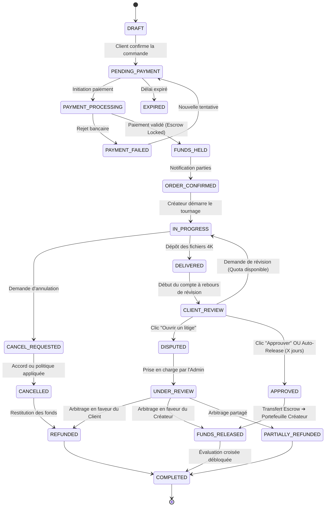

# 🛡️ ARCHITECTURE DU SYSTÈME DE TRANSACTIONS SÉCURISÉES, SÉQUESTRE (ESCROW), LITIGES ET RÉPUTATION — SNAPCONNECT

---

**Document de Conception et d'Architecture Technique**  
**Projet :** SnapConnect (Marketplace Spécialisée Créateurs Smartphone)  
**Auteur :** Lead Software Architect, Product Architect & Senior Frontend Engineer  
**Date :** Août 2026  
**Statut :** Spécification d'Architecture Validée pour le PFE  
**Version :** 1.0.0  

---

## 📑 TABLE DES MATIÈRES

1. [Vision et Principes Fondamentaux de Sécurité Financière](#1-vision-et-principes-fondamentaux)
2. [Flux Métier et Cycle de Vie Global des Transactions](#2-flux-métier-et-cycle-de-vie-global)
3. [Machine à États du Projet (Project State Machine)](#3-machine-à-états-du-projet)
4. [Cycle de Vie des Paiements (Payment Lifecycle)](#4-cycle-de-vie-des-paiements)
5. [Architecture du Séquestre (Escrow System) & Stepper UX](#5-architecture-du-séquestre-escrow)
6. [Système de Double Confirmation & Validation Client](#6-système-de-double-confirmation)
7. [Gestion des Révisions et Retouches](#7-gestion-des-révisions-et-retouches)
8. [Mécanisme de Clôture Automatique (Auto-Release Engine)](#8-mécanisme-de-clôture-automatique)
9. [Système Professionnel de Litiges (Dispute & Claim Management)](#9-système-de-litiges-et-réclamations)
10. [Centre de Résolution Admin & Arbitrage Financier](#10-centre-de-résolution-admin)
11. [Politique et Système d'Annulation (Cancellation Policy)](#11-système-dannulation)
12. [Architecture des Portefeuilles (Wallets) & Tableaux de Bord](#12-architecture-des-portefeuilles-wallets)
13. [Modèle Comptable & Grand Livre d'Audit (Ledger System)](#13-modèle-comptable-et-grand-livre-ledger)
14. [Système d'Évaluation Croisée (Two-Sided Rating System)](#14-système-dévaluation-croisée)
15. [Système de Réputation, Badges et Algorithme de Ranking](#15-système-de-réputation-et-ranking)
16. [Abonnements Professionnels & Modèle Économique](#16-abonnements-professionnels-et-monétisation)
17. [Offres Promotionnelles de Plateforme](#17-offres-promotionnelles)
18. [Moteur de Recommandations Transparent (Rule-Based)](#18-moteur-de-recommandations)
19. [Centre de Confiance & Sécurité (Trust & Safety / Signalements)](#19-centre-de-confiance-et-signalements)
20. [Inventaire des Modèles, Services, Composants et Pages (Existant vs Nouveau)](#20-inventaire-technique)
21. [Exigences Backend Futures & Intégration Passerelles de Paiement](#21-exigences-backend-et-passerelles-de-paiement)
22. [Plan de Déploiement Étape par Étape pour le PFE](#22-plan-de-déploiement-pfe)

---

## 1. VISION ET PRINCIPES FONDAMENTAUX

Sur une marketplace spécialisée comme SnapConnect, la confiance financière est le pilier central. Les clients engagent des sommes pour du contenu créatif immatériel (vidéos TikTok, 4K Reels, shootings produits), tandis que les créateurs investissent du temps, du matériel smartphone haut de gamme et des déplacements avant d'être payés.

Inspiré des mécanismes de sécurité des plateformes financières de premier ordre (Upwork, Bybit, Binance P2P) :
1. **Zéro Transfert Direct Immédiat :** Les fonds ne transitent jamais directement du client vers le compte du créateur à la commande.
2. **Protection Mutuelle par Séquestre (*Escrow*) :**
   - Le créateur ne commence pas à tourner tant que les fonds ne sont pas garantis et verrouillés dans l'Escrow.
   - Le client garde le contrôle total de la validation de ses livrables 4K avant libération du paiement.
3. **Traçabilité Comptable Intégrale (*Double-Entry Ledger*) :** Chaque centime possède une trace immuable (Dépôt, Blocage, Libération, Commission, Retouche, Litige, Remboursement).
4. **Transparence UX ("Où est mon argent ?") :** À tout instant, l'interface affiche explicitement la localisation et le statut exact des fonds.
5. **Neutralité et Sécurité Frontend :** En phase de développement frontend/mock, les simulations sont clairement identifiées sans tromperie, et l'architecture prévoit l'exécution stricte côté serveur (Spring Boot) lors de l'intégration des passerelles réelles (Stripe, Konnect/Flouci en TND/EUR/USD).

---

## 2. FLUX MÉTIER ET CYCLE DE VIE GLOBAL

```
  ┌──────────────┐       1. Commande / Brief       ┌──────────────┐
  │    CLIENT    ├────────────────────────────────►│   CRÉATEUR   │
  └──────┬───────┘                                 └──────┬───────┘
         │ 2. Paiement                                    │
         ▼                                                │
  ┌──────────────────────────────────────────┐            │
  │        SNAPCONNECT ESCROW SÉQUESTRÉ      │            │
  │  (Fonds verrouillés & Sécurisés)         │            │
  └──────┬───────────────────────────────────┘            │
         │                                                │
         │ 3. Alerte "Fonds Sécurisés"                    ▼
         └───────────────────────────────────────► Tournage 4K & Montage
                                                          │
  ┌──────────────┐       5. Inspection 4K                 │ 4. Livraison
  │  VALIDATION  │◄───────────────────────────────────────┘    Livrables
  │    CLIENT    │
  └──┬───┬───┬───┘
     │   │   │
     │   │   └────────► [3. OUVERTURE LITIGE] ──► Arbitrage Administrateur
     │   │
     │   └────────────► [2. DEMANDE RETOUCHE] ──► Nouveau cycle de livraison
     │
     ▼ [1. APPROBATION & LIBÉRATION]
  ┌──────────────────────────────────────────┐
  │        LIBÉRATION DE L'ESCROW            │
  ├─────────────────────┬────────────────────┤
  │ Net Créateur (90%)  │ Commission (10%)   │
  ▼                     ▼                    │
Portefeuille Créateur   Revenus SnapConnect  │
```

---

## 3. MACHINE À ÉTATS DU PROJET

Le cycle de vie du projet/contrat est régi par une machine à états finis stricte et déterministe. Chaque état a une signification unique :

### 3.1 Définition des États (`ProjectStatus`)

| État | Description & Signification Métier |
| :--- | :--- |
| `DRAFT` | Projet ou brief en cours de rédaction par le client, non encore publié ni payé. |
| `PENDING_PAYMENT` | Commande initiée ou devis accepté ; en attente de versement du client vers l'Escrow. |
| `PAYMENT_PROCESSING` | Transaction bancaire en cours de traitement par la passerelle de paiement. |
| `FUNDS_HELD` | Fonds reçus avec succès et verrouillés dans le compte de séquestre SnapConnect. |
| `ORDER_CONFIRMED` | Commande formellement confirmée ; le créateur est notifié qu'il peut démarrer. |
| `IN_PROGRESS` | Créateur en phase de tournage smartphone, captation audio/gimbal et post-production. |
| `DELIVERED` | Livrables soumis par le créateur (fichiers vidéo 4K/photos/liens cloud). |
| `CLIENT_REVIEW` | Période active où le client examine et teste les fichiers livrés. |
| `APPROVED` | Client a validé la conformité et approuvé le travail. |
| `FUNDS_RELEASED` | L'Escrow débloque le montant : solde crédité au créateur déduction faite des frais. |
| `COMPLETED` | Projet entièrement clôturé avec succès ; évaluations débloquées. |
| `CANCEL_REQUESTED` | Demande formelle d'annulation déposée par l'une des parties. |
| `CANCELLED` | Projet annulé selon les conditions de la politique d'annulation ; séquestre dénoué. |
| `DISPUTED` | Litige ouvert suite à un désaccord non résolu sur la livraison ou le périmètre. |
| `UNDER_REVIEW` | Litige pris en charge par l'équipe d'arbitrage Admin SnapConnect. |
| `REFUNDED` | Remboursement intégral accordé au client (Escrow ➔ Client). |
| `PARTIALLY_REFUNDED` | Résolution avec partage financier (Remboursement partiel Client + Paiement partiel Créateur). |
| `PAYMENT_FAILED` | Échec de paiement initial (carte rejetée, fonds insuffisants). |
| `EXPIRED` | Délai de réponse ou de paiement dépassé sans action. |

### 3.2 Diagramme de Transition d'États (Mermaid)



---

## 4. CYCLE DE VIE DES PAIEMENTS

Les statuts de paiement (`PaymentStatus`) sont volontairement **découplés** du statut du projet pour refléter fidèlement l'état bancaire et financier :

```typescript
export type PaymentStatus = 
  | 'PENDING'             // En attente d'initiation
  | 'PROCESSING'          // Traitement passerelle
  | 'SUCCEEDED'           // Capture réussie
  | 'FAILED'              // Rejet
  | 'HELD'                // Séquestré dans l'Escrow
  | 'RELEASED'            // Libéré vers le bénéficiaire
  | 'REFUNDED'            // Remboursé intégralement
  | 'PARTIALLY_REFUNDED'  // Remboursé partiellement
  | 'DISPUTED';           // Gelé pour contestation
```

---

## 5. ARCHITECTURE DU SÉQUESTRE (ESCROW) & STEPPER UX

### 5.1 Composant Visuel "Où est mon argent ?" (Escrow Stepper)
Dans chaque page de contrat/commande, un bandeau visuel transparent indique en temps réel la position exacte des capitaux :

```
[1. PAIEMENT] ──► [2. FONDS EN SÉQUESTRE 🔒] ──► [3. TOURNAGE/LIVRAISON] ──► [4. INSPECTION 4K] ──► [5. LIBÉRATION CRÉATEUR 💰]
```

- **État Actuel :** Mis en surbrillance avec badge lumineux.
- **Détail du Séquestre :**
  - Montant principal bloqué : `500 TND` (ou `EUR/USD`).
  - Commission plateforme estimée : `50 TND` (10%).
  - Gain net créateur garanti : `450 TND`.
  - Date limite de libération automatique : `18 Août 2026 à 18h00`.

---

## 6. SYSTÈME DE DOUBLE CONFIRMATION

Le cœur de la transaction repose sur la double confirmation :
1. **Confirmation Créateur :** Soumission formelle des fichiers vidéos/photos haute résolution avec notes de tournage et spécifications (format 9:16, 60fps, profil colorimétrique).
2. **Revue Client :** Le client inspecte les livrables directement dans le lecteur vidéo 4K intégré.
3. **Déclenchement de l'Approbation :**
   - Clic sur **« Valider & Libérer le Paiement »**.
   - Boîte de dialogue modale de confirmation irréversible :
     > *"Êtes-vous sûr de vouloir approuver ce projet ? Cette action libérera immédiatement 450 TND au créateur Alex Jenkins et clôturera le séquestre."*
   - Exécution :
     - Escrow passe à `RELEASED`.
     - Solde disponible créateur crédité de `+450 TND`.
     - Frais de plateforme SnapConnect crédités de `+50 TND`.
     - Projet passe à `COMPLETED`.

---

## 7. GESTION DES RÉVISIONS ET RETOUCHES

Avant tout litige, la plateforme offre un workflow structuré de retouches :
- **Quota paramétrable selon le forfait :**
  - Formule Starter : `1 retouche`.
  - Formule Pro : `2 à 3 retouches`.
  - Formule Premium : `Retouches configurables / illimitées`.
- **Formulaire de demande de révision obligatoire :**
  - Motif sélectionné (Cadrage, Colorimétrie, Audio, Timing des transitions).
  - Description textuelle précise avec timestamps vidéo (ex: *« À 0:04, couper l'hésitation avant la présentation produit »*).
  - Pièces jointes / captures d'écran d'exemple.
- **Réponse Créateur :** Notification immédiate, mise à jour du projet en `IN_PROGRESS (Revision 1/2)`, et re-dépôt des livrables corrigés.

---

## 8. MÉCANISME DE CLÔTURE AUTOMATIQUE (AUTO-RELEASE ENGINE)

Pour protéger le créateur contre les clients inactifs qui ne répondent pas après réception des livrables :
- **Variable de configuration :** `AUTO_RELEASE_DELAY_DAYS = 3` (3 jours ouvrés par défaut, configurable par l'admin).
- **Compte à rebours affiché :** Horloge temps réel affichée au client (*"Il vous reste 47h 12m pour valider ou demander une retouche"*).
- **Règle :** Si aucun litige, aucune demande de retouche et aucune annulation n'est émise avant l'expiration du délai ➔ Le système déclenche automatiquement l'approbation et la libération des fonds vers le créateur.

---

## 9. SYSTÈME PROFESSIONNEL DE LITIGES (DISPUTES)

Si le dialogue ou les retouches échouent, l'une des deux parties peut ouvrir un litige formel.

### 9.1 Motifs Autorisés
- **Par le Client :**
  - Travail non livré dans les délais.
  - Fichiers non conformes aux spécifications du brief (mauvais smartphone, pas de 4K, format 16:9 au lieu de 9:16 vertical).
  - Qualité audio/vidéo inacceptable ou floue.
  - Créateur injoignable après acceptation.
- **Par le Créateur :**
  - Client exigeant des demandes hors périmètre initial sans rallonge budgétaire.
  - Client refusant abusivement une livraison conforme.
  - Abus caractérisé du système de retouches.
  - Client injoignable pour fournir les éléments essentiels au tournage.

### 9.2 Timeline Chronologique du Litige & Dépôt de Preuves
Le litige génère une vue d'audit complète :
- Dépôt de preuves mutuelles (Captures d'écran, logs de messagerie, fichiers sources bruts).
- Historique horodaté (Création commande ➔ Dépôt séquestre ➔ Livraison ➔ Révisions ➔ Ouverture litige ➔ Réponses).
- **Verrouillage absolu :** Aucun fonds ne peut être libéré tant que le litige est sous statut `OPEN` ou `UNDER_REVIEW`.

---

## 10. CENTRE DE RÉSOLUTION ADMIN

L'administrateur SnapConnect dispose d'un espace d'arbitrage avec 3 décisions possibles :
1. **Remboursement Intégral Client (`RESOLVED_CLIENT`) :** 100% de l'Escrow est retourné au client.
2. **Paiement Intégral Créateur (`RESOLVED_CREATOR`) :** 100% du net est libéré au créateur, commission retenue.
3. **Résolution Partagée (`PARTIAL_RESOLUTION`) :**
   - Exemple pour un projet de 500 TND :
     - Remboursement Client : `200 TND`.
     - Paiement Créateur (pour travail partiel) : `250 TND`.
     - Commission Plateforme : `50 TND`.
   - Génération immédiate des lignes d'écriture dans le Grand Livre comptable (*Ledger*).

---

## 11. SYSTÈME D'ANNULATION ET POLITIQUES

L'annulation obéit à des règles configurables selon le stade d'avancement :

```
Moment de l'Annulation          Règle Financière
──────────────────────────────────────────────────────────────────────────
Avant le versement Escrow       Annulation directe sans frais
Après Escrow, avant tournage    Remboursement 100% au Client
Pendant le tournage             Accord mutuel ou retenue de frais de démarrage
Après livraison des fichiers    Obligation de passer par Révision ou Litige
```

Aucun contrat n'est jamais supprimé de la base : il passe à l'état `CANCELLED` avec motif consigné pour l'historique et la réputation.

---

## 12. ARCHITECTURE DES PORTEFEUILLES (WALLETS)

### 12.1 Portefeuille Client (`ClientWallet`)
- **Solde Disponible :** Fonds prêts pour de futures commandes.
- **Fonds sous Séquestre (Escrow Held) :** Total engagé dans des commandes actives.
- **Dépenses Totales :** Cumul historique des investissements.
- **Remboursements Reçus :** Total des sommes restituées.

### 12.2 Portefeuille Créateur (`CreatorWallet`)
- **Solde Retirable / Disponible :** Fonds libérés prêts au virement bancaire.
- **Gains en Attente (Pending Escrow) :** Montants des tournages en cours non encore validés.
- **Gains Cumulés (Total Earnings) :** Chiffre d'affaires brut réalisé.
- **Commissions Plateforme Payées :** Total des frais SnapConnect déduits.
- **Montants Retirés :** Total des virements bancaires exécutés.

---

## 13. MODÈLE COMPTABLE ET GRAND LIVRE D'AUDIT (LEDGER)

Pour assurer une traçabilité totale (type bancaire / cryptomonnaie), chaque mouvement de fonds génère une transaction d'audit immuable :

```typescript
export type TransactionType =
  | 'DEPOSIT'             // Dépôt client
  | 'PAYMENT'             // Paiement vers commande
  | 'ESCROW_HOLD'         // Verrouillage en séquestre
  | 'ESCROW_RELEASE'      // Déblocage vers créateur
  | 'REFUND'              // Remboursement client
  | 'PARTIAL_REFUND'      // Remboursement partiel
  | 'PLATFORM_FEE'        // Prélèvement commission SnapConnect
  | 'WITHDRAWAL'          // Retrait virement créateur
  | 'CANCELLATION'        // Dénouement suite annulation
  | 'DISPUTE_ADJUSTMENT'; // Ajustement suite arbitrage
```

### Exemple de Trace d'Écriture
```
TxRef: TX-2026-00891
Type: ESCROW_HOLD
Montant: 500 TND
Source: Portefeuille Client #cl-12
Destination: Compte Séquestre SnapConnect #ESC-99
Projet: #ct-142 (Cosmetics 4K Reels)
Date: 14/08/2026 14:32:10 UTC
Statut: SUCCEEDED
```

---

## 14. SYSTÈME D'ÉVALUATION CROISÉE (TWO-SIDED RATING)

Le système d'évaluation protège les deux côtés de la communauté :

### 14.1 Le Client évalue le Créateur (5 Critères) :
1. Qualité du rendu photo/vidéo 4K.
2. Maîtrise du smartphone & stabilisation (Gimbal).
3. Communication & réactivité.
4. Respect des délais de livraison.
5. Rapport qualité / prix.
- **Tags de mérite optionnels :** `⚡ Livraison Ultra-Rapide`, `🎬 Cadrage Cinématographique`, `📱 Expert iPhone 16 Pro`, `✨ Retouches Parfaites`.

### 14.2 Le Créateur évalue le Client (5 Critères) :
1. Clarté du brief et des exigences.
2. Respect du périmètre convenu.
3. Rapidité de réponse et communication.
4. Ponctualité de validation et libération des fonds.
5. Professionnalisme global.

### 14.3 Règles Anti-Fraude :
- L'évaluation n'est accessible **qu'une seule fois** par contrat et **uniquement si `status === 'COMPLETED'`**.
- Impossible d'évaluer une commande annulée ou non financée.

---

## 15. SYSTÈME DE RÉPUTATION, BADGES ET RANKING

### 15.1 Niveaux de Créateurs (Creator Levels)
- 🟢 **NEW CREATOR :** Nouveau compte vérifié, moins de 3 projets.
- 🔵 **RISING CREATOR :** 5+ projets, note > 4.7, taux de complétion > 95%.
- 🟣 **PRO CREATOR :** 20+ projets, note > 4.85, délai moyen < 48h, smartphone certifié 4K ProRes.
- 👑 **TOP CREATOR :** 50+ projets, note > 4.9, 0 litige perdu, 30%+ de clients récurrents.
- ⭐ **ELITE CREATOR :** Top 1% de la plateforme, sélectionné pour les campagnes de grandes marques.

### 15.2 Algorithme de Score Pondéré (Creator Ranking Formula)

$$\text{Score} = (W_r \times R) + (W_c \times C) + (W_t \times T) + (W_s \times S) - (W_d \times D)$$

Où :
- $R$ : Note moyenne pondérée (1 à 5).
- $C$ : Taux de complétion des projets (%).
- $T$ : Taux de livraison dans les temps (On-Time Delivery %).
- $S$ : Vitesse de réponse moyenne (heures).
- $D$ : Taux de litiges / réclamations (pénalité forte).

---

## 16. ABONNEMENTS PROFESSIONNELS & MONÉTISATION

SnapConnect génère des revenus via :
1. **Commissions sur Transactions :** 10% par défaut sur chaque contrat finalisé.
2. **Abonnements Créateurs (Creator Plans) :**
   - **FREE :** Profil standard, 10 propositions/mois, commission 12%.
   - **PRO (29 TND/mois) :** Badge Pro, 40 propositions/mois, commission réduite à 8%, boost de visibilité dans la recherche.
   - **PREMIUM (69 TND/mois) :** Badge Elite, propositions illimitées, commission 5%, placement vedette sur la page d'accueil, support prioritaire 24/7.
3. **Abonnements Clients (Business Plans) :**
   - **FREE :** 3 briefs simultanés.
   - **BUSINESS (49 TND/mois) :** Briefs illimités, filtres de créateurs avancés, facturation centralisée multi-utilisateurs.

---

## 17. OFFRES PROMOTIONNELLES

Système de coupons et campagnes administrables :
- Réduction premier projet (ex: `-20%` sur les frais de plateforme).
- Campagnes thématiques saisonnières (*Summer Food Shoot*, *Black Friday UGC*).
- Parrainage créateur/client avec bonus de crédit portefeuille.

---

## 18. MOTEUR DE RECOMMANDATIONS TRANSPARENT

Moteur de recommandation basé sur des règles explicites et transparentes :
- **Pour le Client :** Recommandation de créateurs selon la catégorie du brief, le budget, la proximité géographique, et le modèle de smartphone exigé.
- **Pour le Créateur :** Recommandation de missions ouvertes correspondant à son matériel (ex: *"Brief exigeant un iPhone 16 Pro 4K 60fps"*), ses catégories favorites et son taux horaire habituel.

---

## 19. CENTRE DE CONFIANCE & SIGNALEMENTS (TRUST & SAFETY)

Module de protection communautaire :
- **Signalement de contenu :** Signalement d'utilisateur, de brief frauduleux, de message déplacé, d'usurpation de portfolio ou de tentative de paiement hors plateforme.
- **Console de modération Admin :** File d'attente de traitement avec avertissement, suspension temporaire ou bannissement définitif.

---

## 20. INVENTAIRE TECHNIQUE (EXISTANT VS NOUVEAU)

### 20.1 Modèles de Données (`src/app/core/models/`)

| Modèle | Statut | Action / Rôle |
| :--- | :---: | :--- |
| `contract.model.ts` | **EXISTANT** | ✅ Étendre avec les nouveaux états (`DISPUTED`, `FUNDS_RELEASED`, etc.) et données d'Escrow. |
| `payment.model.ts` | **EXISTANT** | ✅ Étendre avec les types de transaction (`ESCROW_HOLD`, `ESCROW_RELEASE`) et le Ledger. |
| `wallet.model.ts` | **NOUVEAU** | 🆕 Modèle pour Portefeuille Client & Créateur (Available, Escrow Held, Total Earnings). |
| `dispute.model.ts` | **NOUVEAU** | 🆕 Modèle complet de litige (Motifs, Timeline, Preuves, Arbitrage Admin). |
| `reputation.model.ts`| **NOUVEAU** | 🆕 Modèle pour Niveaux Créateurs, Badges et Critères d'évaluation croisée. |
| `subscription.model.ts`| **NOUVEAU** | 🆕 Modèle pour les forfaits Pro/Business et avantages. |
| `recommendation.model.ts`| **NOUVEAU** | 🆕 Modèle pour les suggestions personnalisées de talents et de missions. |

### 20.2 Services Réactifs (`src/app/core/services/`)

| Service | Statut | Action / Rôle |
| :--- | :---: | :--- |
| `contract.service.ts` | **EXISTANT** | ✅ Réutiliser pour la gestion de l'état du contrat et de l'approbation. |
| `payment.service.ts` | **EXISTANT** | ✅ Réutiliser pour le grand livre des transactions et simulations Escrow. |
| `wallet.service.ts` | **NOUVEAU** | 🆕 Gestion du solde, des fonds bloqués en séquestre et des retraits. |
| `dispute.service.ts` | **NOUVEAU** | 🆕 Gestion de l'ouverture de litige, dépôt de preuves et résolution admin. |
| `reputation.service.ts`| **NOUVEAU** | 🆕 Calcul du score de ranking, attribution des badges et avis croisés. |

### 20.3 Composants Réutilisables (`src/app/shared/components/`)

| Composant | Statut | Action / Rôle |
| :--- | :---: | :--- |
| `navbar.component.ts` | **EXISTANT** | ✅ Réutiliser avec affichage du solde wallet et badges de notifications. |
| `rating-stars.component.ts` | **EXISTANT** | ✅ Réutiliser pour l'affichage des notes par critère. |
| `media-modal.component.ts` | **EXISTANT** | ✅ Réutiliser pour l'inspection des vidéos 4K avant approbation. |
| `escrow-stepper.component.ts` | **NOUVEAU** | 🆕 Stepper visuel "Où est mon argent ?" à 5 étapes. |
| `dispute-timeline.component.ts`| **NOUVEAU** | 🆕 Vue chronologique des événements et preuves de litige. |
| `wallet-card.component.ts` | **NOUVEAU** | 🆕 Carte synthétique du solde et fonds sous séquestre. |
| `creator-badge.component.ts` | **NOUVEAU** | 🆕 Badge dynamique (Verified, Top Creator, Fast Responder). |

---

## 21. EXIGENCES BACKEND FUTURES & PASSERELLES DE PAIEMENT

Lors de la phase d'intégration réelle avec le backend Spring Boot :
- **Passerelles Cibles :** Stripe Connect (pour EUR/USD international) & Konnect / Flouci (pour le marché tunisien en TND).
- **Architecture Webhooks Asynchrones :** `PaymentIntent` ➔ Webhook `payment_intent.succeeded` ➔ Mise à jour atomique du statut Escrow et création de l'enregistrement Ledger immuable.
- **Idempotence :** Toutes les opérations financières utiliseront une clé d'idempotence (`Idempotency-Key`) pour empêcher les doubles débits.
- **Sécurité :** Aucun calcul de commission ou autorisation de libération ne sera confié au client frontend ; l'API REST Spring Boot validera systématiquement les privilèges et les montants.

---

## 22. PLAN DE DÉPLOIEMENT ÉTAPE PAR ÉTAPE (PFE)

Pour garantir une progression méthodique et sans sur-ingénierie :

1. **PHASE 1 (Socle UX & Modèles) :** Création des modèles TypeScript enrichis (`wallet`, `dispute`, `reputation`, `subscription`, `recommendation`), des services de simulation réactifs Signals et des composants partagés (`escrow-stepper`, `wallet-card`, `dispute-timeline`).
2. **PHASE 2 (Expérience Client & Escrow) :** Intégration du stepper Escrow dans `/client/contracts/:id`, du bouton d'approbation à double confirmation, du formulaire de retouches et de la page `/client/wallet`.
3. **PHASE 3 (Expérience Créateur Studio) :** Intégration du suivi des livrables 4K, de la page `/creator/wallet` (Gains disponibles, pending escrow) et du système de retrait.
4. **PHASE 4 (Module Litiges & Arbitrage Admin) :** Formulaire d'ouverture de réclamation, modale de preuves et console d'arbitrage dans `/admin/disputes`.
5. **PHASE 5 (Évaluations Croisées & Réputation) :** Formulaire d'évaluation multi-critères après `COMPLETED`, badges et niveaux créateurs.
6. **PHASE 6 (Monétisation & Abonnements) :** Pages de présentation des forfaits Pro/Business et simulation de souscription.
7. **PHASE 7 (Recommandations Intelligentes) :** Blocs de suggestions personnalisées sur la page d'accueil et les dashboards.

---

> [!NOTE]
> Ce document constitue le cahier des charges d'architecture pour le système de transaction sécurisée de SnapConnect.
